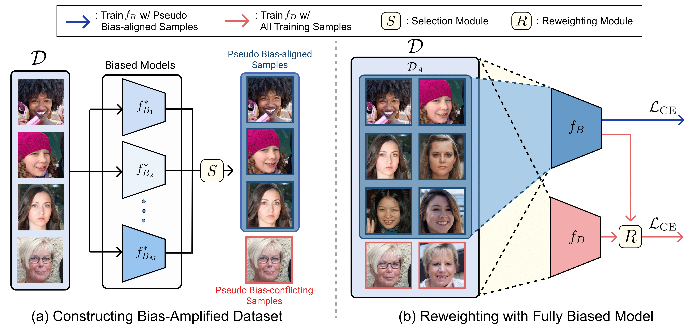

# BiasEnsemble

This is official PyTorch implementation of "**Revisiting the Importance of Amplifying Bias for Debiasing**" (AAAI 2023).

> [Jungsoo Lee](https://leebebeto.github.io/)<sup>12*</sup>, [Jeonghoon Park](https://atjeong.github.io/)<sup>12*</sup>, [Daeyoung Kim](https://github.com/cyc1am3n)<sup>1*</sup>, [Juyoung Lee](https://sites.google.com/view/juyoung-lee)<sup>2</sup>, Edward Choi<sup>1</sup>, Jaegul Choo<sup>1</sup> <br>
> <sup>1</sup> KAIST <sup>2</sup> Kakao Enterprise, South Korea <br>
> <sup>*</sup> Equal Contribution <br>
> [arXiv](https://arxiv.org/abs/2205.14594) <br>



> **Abstract**: In image classification, *debiasing* aims to train a classifier to be less susceptible to dataset bias, the strong correlation between peripheral attributes of data samples and a target class. For example, even if the frog class in the dataset mainly consists of frog images with a swamp background (*i.e.,* bias-aligned samples), a debiased classifier should be able to correctly classify a frog at a beach (*i.e.,* bias-conflicting samples). Recent debiasing approaches commonly use two components for debiasing, a biased model $f_B$ and a debiased model $f_D$. $f_B$ is trained to focus on bias-aligned samples (*i.e.,* overfitted to the bias) while $f_D$ is mainly trained with bias-conflicting samples by concentrating on samples which $f_B$ fails to learn, leading $f_D$ to be less susceptible to the dataset bias. While the state-of-the-art debiasing techniques have aimed to better train $f_D$, we focus on training $f_B$, an overlooked component until now. Our empirical analysis reveals that removing the bias-conflicting samples from the training set for $f_B$ is important for improving the debiasing performance of $f_D$. This is due to the fact that the bias-conflicting samples work as noisy samples for amplifying the bias for $f_B$ since those samples do not include the bias attribute. To this end, we propose a *simple yet effective* data sample selection method which removes the bias-conflicting samples to construct a bias-amplified dataset for training $f_B$. Our data sample selection method can be directly applied to existing reweighting-based debiasing approaches, obtaining consistent performance boost and achieving the state-of-the-art performance on both synthetic and real-world datasets.
> 

<br>

## Setup

- Clone this repo and install dependencies.

```python
git clone https://github.com/kakaoenterprise/BiasEnsemble.git
cd BiasEnsemble
pip install -r requirements.txt
```

<br>

## Datasets

- Download the datasets from this [link](https://drive.google.com/drive/folders/1q_8zIqJHVSxjU2p5zaN1l2Zf-uSmS6Fx?usp=sharing) and locate them under the path `./dataset` .
- Unzip each dataset with the following scripts.

```python
# cmnist
bash ./scripts/unzip_codes/unzip_cmnist.sh
# BFFHQ
bash ./scripts/unzip_codes/unzip_bffhq.sh
# Dogs & Cats
bash ./scripts/unzip_codes/unzip_dnc.sh
# BAR
bash ./scripts/unzip_codes/unzip_bar.sh
```

- Note that cmnist and BFFHQ are the datasets used in the “Learning Debiased Representation via Disentangled Feature Augmentation” (Lee et al., NeurIPS 2021). For Dogs & Cats and BAR, we provide the datasets having different levels of bias severity by manipulating the datasets of Dogs and Cats from “Learning Not to Learn: Training Deep Neural Networks with Biased Data (Kim et al., CVPR 2019)” and [BAR](https://github.com/alinlab/BAR) from “Learning from Failure: Training Debiased Classifier from Biased Classifier(Nam et al., NeurIPS 2020)”, respectively.

<br>

## Training with BiasEnsemble

You can train the model of LfF(”Learning from Failure: Training Debiased Classifier from Biased Classifier”(Nam et al., NeurIPS 2020)) and DisEnt(”Learning Debiased Representation via Disentangled Feature Augmentation”(Lee et al., NeurIPS 2021)) with BiasEnsemble using the following commands.

### LFF + BiasEnsemble

### cmnist

```python
python train.py --train_lff_be --dataset=cmnist --percent=0.5pct --lr=0.01 --exp=lff_be_cmnist_0.5pct --tensorboard
python train.py --train_lff_be --dataset=cmnist --percent=1pct --lr=0.01 --exp=lff_be_cmnist_1pct --tensorboard
python train.py --train_lff_be --dataset=cmnist --percent=2pct --lr=0.01 --exp=lff_be_cmnist_2pct --tensorboard
python train.py --train_lff_be --dataset=cmnist --percent=5pct --lr=0.01 --exp=lff_be_cmnist_5pct --tensorboard
```

### BFFHQ

```python
python train.py --train_lff_be --dataset=bffhq --percent=0.5pct --lr=0.0001 --exp=lff_be_bffhq_0.5pct --tensorboard
python train.py --train_lff_be --dataset=bffhq --percent=1pct --lr=0.0001 --exp=lff_be_bffhq_1pct --tensorboard
python train.py --train_lff_be --dataset=bffhq --percent=2pct --lr=0.0001 --exp=lff_be_bffhq_2pct --tensorboard
python train.py --train_lff_be --dataset=bffhq --percent=5pct --lr=0.0001 --exp=lff_be_bffhq_5pct --tensorboard
```

### Dogs & Cats

```python
python train.py --train_lff_be --dataset=dogs_and_cats --percent=1pct --lr=0.0001 --exp=lff_be_dnc_1pct --tensorboard
python train.py --train_lff_be --dataset=dogs_and_cats --percent=5pct --lr=0.0001 --exp=lff_be_dnc_5pct --tensorboard
```

### BAR

```python
python train.py --train_lff_be --dataset=bar --percent=1pct --lr=0.00001 --resnet_pretrained --exp=lff_be_bar_1pct --tensorboard
python train.py --train_lff_be --dataset=bar --percent=5pct --lr=0.00001 --resnet_pretrained --exp=lff_be_bar_5pct --tensorboard
```

### DisEnt + BiasEnsemble

### cmnist

```python
python train.py --train_disent_be --dataset=cmnist --percent=0.5pct --lr=0.01 --exp=disent_be_cmnist_0.5pct --curr_step=10000 --lambda_swap=1 --lambda_dis_align=10 --lambda_swap_align=10 --use_lr_decay --lr_decay_step=10000 --lr_gamma=0.5 --tensorboard 
python train.py --train_disent_be --dataset=cmnist --percent=1pct --lr=0.01 --exp=disent_be_cmnist_1pct --curr_step=10000 --lambda_swap=1 --lambda_dis_align=10 --lambda_swap_align=10 --use_lr_decay --lr_decay_step=10000 --lr_gamma=0.5 --tensorboard 
python train.py --train_disent_be --dataset=cmnist --percent=2pct --lr=0.01 --exp=disent_be_cmnist_2pct --curr_step=10000 --lambda_swap=1 --lambda_dis_align=10 --lambda_swap_align=10 --use_lr_decay --lr_decay_step=10000 --lr_gamma=0.5 --tensorboard 
python train.py --train_disent_be --dataset=cmnist --percent=5pct --lr=0.01 --exp=disent_be_cmnist_5pct --curr_step=10000 --lambda_swap=1 --lambda_dis_align=10 --lambda_swap_align=10 --use_lr_decay --lr_decay_step=10000 --lr_gamma=0.5 --tensorboard 
```

### BFFHQ

```python
python train.py --train_disent_be --dataset=bffhq --percent=0.5pct --lr=0.0001 --exp=disent_be_bffhq_0.5pct --curr_step=10000 --lambda_swap=0.1 --lambda_dis_align=2 --lambda_swap_align=2 --use_lr_decay --lr_decay_step=10000 --lr_gamma=0.1 --tensorboard
python train.py --train_disent_be --dataset=bffhq --percent=1pct --lr=0.0001 --exp=disent_be_bffhq_1pct --curr_step=10000 --lambda_swap=0.1 --lambda_dis_align=2 --lambda_swap_align=2 --use_lr_decay --lr_decay_step=10000 --lr_gamma=0.1 --tensorboard
python train.py --train_disent_be --dataset=bffhq --percent=2pct --lr=0.0001 --exp=disent_be_bffhq_2pct --curr_step=10000 --lambda_swap=0.1 --lambda_dis_align=2 --lambda_swap_align=2 --use_lr_decay --lr_decay_step=10000 --lr_gamma=0.1 --tensorboard
python train.py --train_disent_be --dataset=bffhq --percent=5pct --lr=0.0001 --exp=disent_be_bffhq_5pct --curr_step=10000 --lambda_swap=0.1 --lambda_dis_align=2 --lambda_swap_align=2 --use_lr_decay --lr_decay_step=10000 --lr_gamma=0.1 --tensorboard
```

### Dogs & Cats

```python
python train.py --train_disent_be --dataset=dogs_and_cats --percent=1pct --lr=0.0001 --exp=disent_be_dnc_1pct --curr_step=10000 --lambda_swap=1 --lambda_dis_align=1 --lambda_swap_align=1 --use_lr_decay --lr_decay_step=10000 --lr_gamma=0.1 --tensorboard
python train.py --train_disent_be --dataset=dogs_and_cats --percent=5pct --lr=0.0001 --exp=disent_be_dnc_5pct --curr_step=10000 --lambda_swap=1 --lambda_dis_align=1 --lambda_swap_align=1 --use_lr_decay --lr_decay_step=10000 --lr_gamma=0.1 --tensorboard
```

### BAR

```python
python train.py --train_disent_be --dataset=bar --percent=1pct --lr=0.00001 --resnet_pretrained --exp=disent_be_bar_1pct --curr_step=10000 --lambda_swap=1 --lambda_dis_align=1 --lambda_swap_align=1 --use_lr_decay --lr_decay_step=10000 --lr_gamma=0.1 --tensorboard
python train.py --train_disent_be --dataset=bar --percent=5pct --lr=0.00001 --resnet_pretrained --exp=disent_be_bar_5pct --curr_step=10000 --lambda_swap=1 --lambda_dis_align=1 --lambda_swap_align=1 --use_lr_decay --lr_decay_step=10000 --lr_gamma=0.1 --tensorboard
```

<br>

## Test

You can test the pretrained model with the following commands.

### LFF + BiasEnsemble

```python
python test.py --test_lff_be --dataset <dataset> --percent <bias_severity> --pretrained_path <pretrained_ckpt_path>
```

### DisEnt + BiasEnsemble

```python
python test.py --test_disent_be --dataset <dataset> --percent <bias_severity> --pretrained_path <pretrained_ckpt_path>
```

### Pretrained Models

- We provide the pretrained model checkpoints in [here](https://drive.google.com/drive/folders/1sDwNUeFTIcidtw2y_G7iDSOYkBEFsPGt?usp=share_link).

<br>

## Contact

Jungsoo Lee [[Website]](https://leebebeto.github.io/) [[LinkedIn]](https://www.linkedin.com/in/jungsoo-lee-52103a17a/) [[Google Scholar]](https://scholar.google.com/citations?user=qSGLUDQAAAAJ&hl=ko) (KAIST AI)

Jeonghoon Park [[Website]](https://atjeong.github.io/) [[Google Scholar]](https://scholar.google.co.kr/citations?user=f0FspZwAAAAJ&hl=ko) (KAIST AI)

Daeyoung Kim [[Website]](https://cyc1am3n.github.io/) [[LinkedIn]](https://kr.linkedin.com/in/daeyoung-kim-b1b77a242) [[Google Scholar]](https://scholar.google.com/citations?user=_Bd2HqUAAAAJ&hl=ko) (KAIST AI)

Juyoung Lee [[Website]](https://sites.google.com/view/juyoung-lee) (Kakao Enterprise)

<br>

## Acknowledgments

This work was mainly done when both of the first two authors were doing internship at Kakao Enterprise. Our code is based on [LfF](https://github.com/alinlab/LfF) and [DisEnt](https://github.com/kakaoenterprise/Learning-Debiased-Disentangled).
